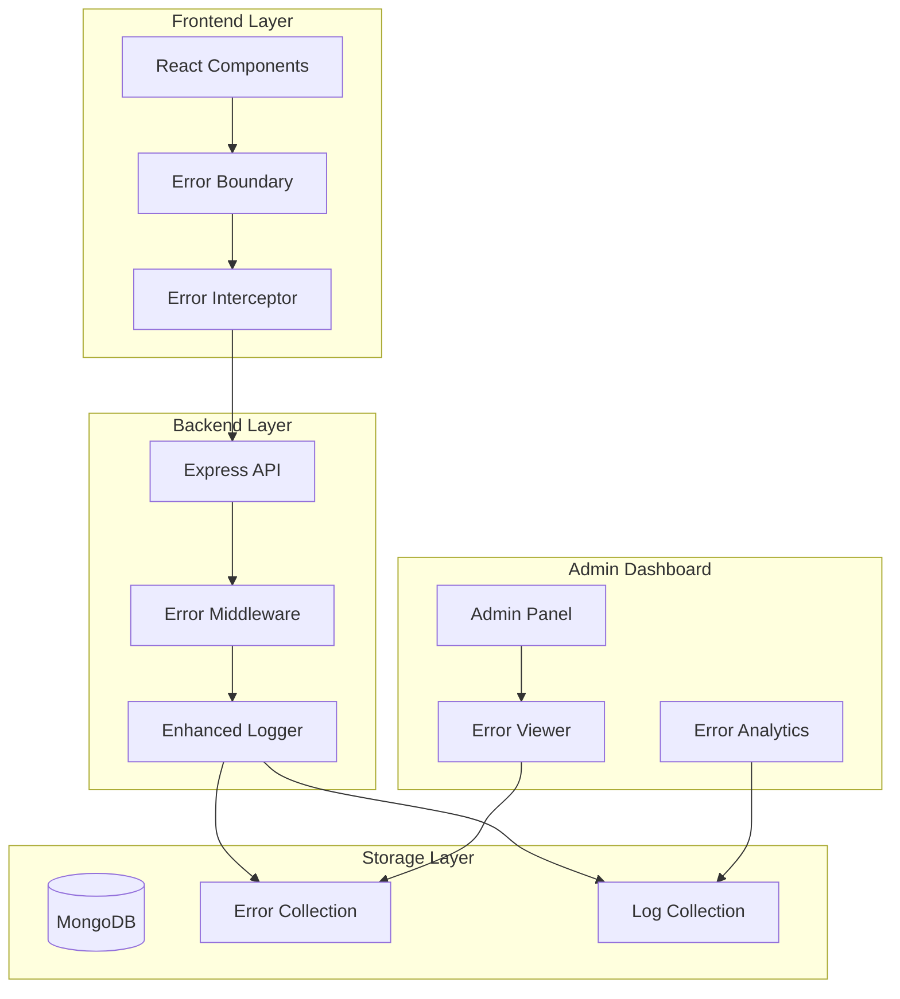
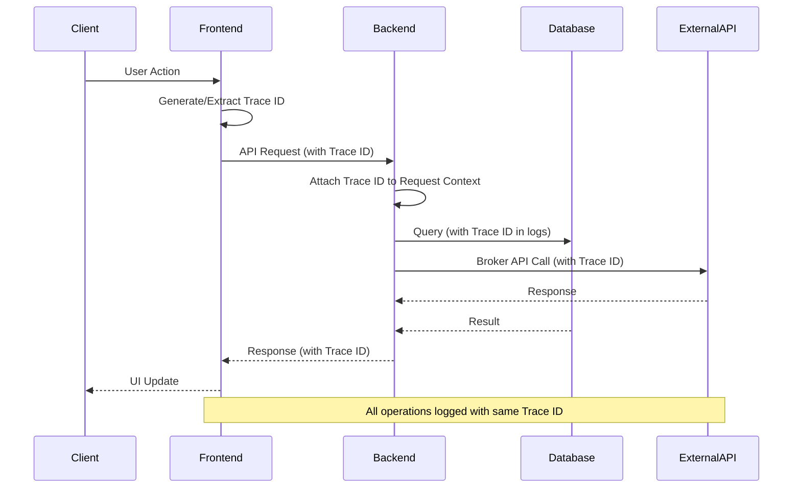

# Design Document

## Overview

The robust error logging system for CopyTrade Pro will enhance the existing logging infrastructure to provide comprehensive error tracking, analysis, and visualization capabilities. The system will capture detailed error information across the entire application stack (frontend, backend, database, external APIs) with unique trace IDs for request lifecycle tracking, structured logging for easy analysis, and an admin dashboard interface for error monitoring and management.

## Architecture

### High-Level Architecture



### Trace ID Flow



## Components and Interfaces

### 1. Enhanced Error Logger Service

**Location**: `backend/src/services/errorLoggingService.ts`

```typescript
interface ErrorLogEntry {
  id: string;
  traceId: string;
  timestamp: Date;
  level: 'ERROR' | 'WARN' | 'INFO' | 'DEBUG';
  source: 'UI' | 'BE' | 'DB' | 'API';
  component: string;
  operation: string;
  message: string;
  errorType: string;
  stackTrace?: string;
  context: {
    requestId?: string;
    userId?: string;
    sessionId?: string;
    userAgent?: string;
    ipAddress?: string;
    brokerName?: string;
    accountId?: string;
    url?: string;
    method?: string;
    statusCode?: number;
    duration?: number;
    retryCount?: number;
  };
  metadata: {
    environment: string;
    version: string;
    nodeVersion: string;
    platform: string;
  };
  relatedErrors?: string[]; // Array of related error IDs
}

interface ErrorAnalytics {
  totalErrors: number;
  errorsByType: Record<string, number>;
  errorsByComponent: Record<string, number>;
  errorsByTimeRange: Array<{ timestamp: Date; count: number }>;
  topErrors: Array<{ message: string; count: number; lastOccurred: Date }>;
  errorTrends: {
    hourly: number[];
    daily: number[];
    weekly: number[];
  };
}
```

### 2. Trace ID Management Service

**Location**: `backend/src/services/traceIdService.ts`

```typescript
interface TraceContext {
  traceId: string;
  parentSpanId?: string;
  spanId: string;
  startTime: Date;
  operations: Array<{
    operation: string;
    component: string;
    startTime: Date;
    endTime?: Date;
    status: 'SUCCESS' | 'ERROR' | 'PENDING';
    metadata?: any;
  }>;
}

interface TraceIdService {
  generateTraceId(): string;
  createTraceContext(traceId?: string): TraceContext;
  addOperation(traceId: string, operation: string, component: string): void;
  completeOperation(traceId: string, operation: string, status: 'SUCCESS' | 'ERROR', metadata?: any): void;
  getTraceContext(traceId: string): TraceContext | null;
  getTraceLifecycle(traceId: string): TraceLifecycle;
}
```

### 3. Frontend Error Capture Service

**Location**: `frontend/src/services/errorCaptureService.ts`

```typescript
interface FrontendErrorEntry {
  id: string;
  traceId: string;
  timestamp: Date;
  source: 'UI';
  errorType: 'JAVASCRIPT' | 'REACT' | 'API' | 'NETWORK' | 'VALIDATION';
  message: string;
  stackTrace?: string;
  componentStack?: string;
  context: {
    url: string;
    userAgent: string;
    userId?: string;
    sessionId?: string;
    component?: string;
    props?: any;
    state?: any;
    userActions?: Array<{
      action: string;
      timestamp: Date;
      element?: string;
    }>;
  };
  browserInfo: {
    name: string;
    version: string;
    platform: string;
    language: string;
    cookieEnabled: boolean;
    onLine: boolean;
  };
}
```

### 4. Database Error Models

**Location**: `backend/src/models/errorModels.ts`

```typescript
// MongoDB Schema for Error Logs
const ErrorLogSchema = new Schema({
  traceId: { type: String, required: true, index: true },
  timestamp: { type: Date, required: true, index: true },
  level: { type: String, enum: ['ERROR', 'WARN', 'INFO', 'DEBUG'], required: true },
  source: { type: String, enum: ['UI', 'BE', 'DB', 'API'], required: true },
  component: { type: String, required: true, index: true },
  operation: { type: String, required: true },
  message: { type: String, required: true },
  errorType: { type: String, required: true, index: true },
  stackTrace: { type: String },
  context: {
    requestId: String,
    userId: { type: String, index: true },
    sessionId: String,
    userAgent: String,
    ipAddress: String,
    brokerName: String,
    accountId: String,
    url: String,
    method: String,
    statusCode: Number,
    duration: Number,
    retryCount: Number
  },
  metadata: {
    environment: String,
    version: String,
    nodeVersion: String,
    platform: String
  },
  relatedErrors: [{ type: String }],
  resolved: { type: Boolean, default: false },
  resolvedAt: Date,
  resolvedBy: String,
  resolution: String
});

// Compound indexes for efficient querying
ErrorLogSchema.index({ timestamp: -1, level: 1 });
ErrorLogSchema.index({ traceId: 1, timestamp: 1 });
ErrorLogSchema.index({ component: 1, errorType: 1, timestamp: -1 });
ErrorLogSchema.index({ 'context.userId': 1, timestamp: -1 });
```

### 5. Admin Dashboard Error Components

**Location**: `frontend/src/components/admin/ErrorDashboard.tsx`

```typescript
interface ErrorDashboardProps {
  timeRange: 'hour' | 'day' | 'week' | 'month';
  filters: {
    level?: string[];
    source?: string[];
    component?: string[];
    errorType?: string[];
  };
}

interface ErrorListProps {
  errors: ErrorLogEntry[];
  onErrorSelect: (error: ErrorLogEntry) => void;
  onResolveError: (errorId: string, resolution: string) => void;
}

interface ErrorDetailProps {
  error: ErrorLogEntry;
  traceLifecycle: TraceLifecycle;
  relatedErrors: ErrorLogEntry[];
}
```

## Data Models

### Error Log Collection Structure

```json
{
  "_id": "ObjectId",
  "traceId": "trace_abc123def456",
  "timestamp": "2025-01-08T10:30:00.000Z",
  "level": "ERROR",
  "source": "BE",
  "component": "BROKER_CONTROLLER",
  "operation": "PLACE_ORDER",
  "message": "Failed to place order due to insufficient funds",
  "errorType": "BROKER_API_ERROR",
  "stackTrace": "Error: Insufficient funds\n    at BrokerController.placeOrder...",
  "context": {
    "requestId": "req_789xyz",
    "userId": "user_123",
    "sessionId": "sess_456",
    "userAgent": "Mozilla/5.0...",
    "ipAddress": "192.168.1.100",
    "brokerName": "zerodha",
    "accountId": "acc_789",
    "url": "/api/broker/place-order",
    "method": "POST",
    "statusCode": 400,
    "duration": 1250,
    "retryCount": 0
  },
  "metadata": {
    "environment": "production",
    "version": "1.0.0",
    "nodeVersion": "18.17.0",
    "platform": "linux"
  },
  "relatedErrors": ["error_id_1", "error_id_2"],
  "resolved": false,
  "createdAt": "2025-01-08T10:30:00.000Z",
  "updatedAt": "2025-01-08T10:30:00.000Z"
}
```

### Trace Lifecycle Collection Structure

```json
{
  "_id": "ObjectId",
  "traceId": "trace_abc123def456",
  "startTime": "2025-01-08T10:29:58.000Z",
  "endTime": "2025-01-08T10:30:02.000Z",
  "duration": 4000,
  "status": "ERROR",
  "operations": [
    {
      "operation": "AUTHENTICATE_USER",
      "component": "AUTH_MIDDLEWARE",
      "startTime": "2025-01-08T10:29:58.100Z",
      "endTime": "2025-01-08T10:29:58.200Z",
      "status": "SUCCESS",
      "metadata": { "userId": "user_123" }
    },
    {
      "operation": "VALIDATE_ORDER",
      "component": "ORDER_VALIDATOR",
      "startTime": "2025-01-08T10:29:58.300Z",
      "endTime": "2025-01-08T10:29:58.400Z",
      "status": "SUCCESS"
    },
    {
      "operation": "PLACE_ORDER",
      "component": "BROKER_CONTROLLER",
      "startTime": "2025-01-08T10:29:58.500Z",
      "endTime": "2025-01-08T10:30:00.000Z",
      "status": "ERROR",
      "metadata": { "errorType": "INSUFFICIENT_FUNDS" }
    }
  ],
  "errorCount": 1,
  "warningCount": 0
}
```

## Error Handling

### Error Classification System

```typescript
enum ErrorCategory {
  AUTHENTICATION = 'AUTHENTICATION',
  AUTHORIZATION = 'AUTHORIZATION',
  VALIDATION = 'VALIDATION',
  BROKER_API = 'BROKER_API',
  DATABASE = 'DATABASE',
  NETWORK = 'NETWORK',
  BUSINESS_LOGIC = 'BUSINESS_LOGIC',
  SYSTEM = 'SYSTEM',
  EXTERNAL_SERVICE = 'EXTERNAL_SERVICE'
}

enum ErrorSeverity {
  LOW = 'LOW',
  MEDIUM = 'MEDIUM',
  HIGH = 'HIGH',
  CRITICAL = 'CRITICAL'
}

interface ErrorClassification {
  category: ErrorCategory;
  severity: ErrorSeverity;
  isRetryable: boolean;
  requiresUserAction: boolean;
  affectsTrading: boolean;
}
```

### Error Recovery Strategies

```typescript
interface ErrorRecoveryStrategy {
  errorType: string;
  maxRetries: number;
  retryDelay: number;
  backoffMultiplier: number;
  fallbackAction?: string;
  userNotification?: {
    level: 'info' | 'warning' | 'error';
    message: string;
    actionRequired: boolean;
  };
}
```

## Testing Strategy

### Unit Tests

1. **Error Logging Service Tests**
   - Test error capture and storage
   - Test trace ID generation and management
   - Test error classification logic
   - Test log aggregation and analytics

2. **Frontend Error Capture Tests**
   - Test React Error Boundary functionality
   - Test JavaScript error capture
   - Test API error interception
   - Test error context collection

3. **Middleware Tests**
   - Test error middleware integration
   - Test trace ID propagation
   - Test request context capture

### Integration Tests

1. **End-to-End Error Flow Tests**
   - Test complete error lifecycle from frontend to storage
   - Test trace ID consistency across services
   - Test error correlation and grouping

2. **Admin Dashboard Tests**
   - Test error visualization components
   - Test filtering and search functionality
   - Test error resolution workflow

### Performance Tests

1. **Logging Performance Tests**
   - Test logging overhead under high load
   - Test database write performance
   - Test memory usage with large error volumes

2. **Query Performance Tests**
   - Test error search and filtering performance
   - Test analytics query performance
   - Test dashboard loading times

## Implementation Phases

### Phase 1: Enhanced Backend Error Logging
- Extend existing logger with error-specific functionality
- Implement trace ID service
- Create error log database models
- Add comprehensive error middleware

### Phase 2: Frontend Error Capture
- Implement React Error Boundaries
- Add JavaScript error capture
- Create error reporting service
- Integrate with backend error logging

### Phase 3: Admin Dashboard Integration
- Create error dashboard components
- Implement error visualization
- Add filtering and search capabilities
- Create error resolution workflow

### Phase 4: Analytics and Monitoring
- Implement error analytics service
- Add real-time error monitoring
- Create error trend analysis
- Add automated error alerting

## Security Considerations

1. **Data Sanitization**
   - Remove sensitive data from error logs
   - Mask PII in error messages
   - Sanitize stack traces

2. **Access Control**
   - Restrict error log access to admin users
   - Implement role-based error viewing
   - Audit error log access

3. **Data Retention**
   - Implement log rotation policies
   - Archive old error logs
   - Comply with data retention regulations

## Performance Considerations

1. **Asynchronous Logging**
   - Use non-blocking error logging
   - Implement log queuing for high volume
   - Batch database writes

2. **Indexing Strategy**
   - Create efficient database indexes
   - Optimize query performance
   - Monitor index usage

3. **Memory Management**
   - Limit in-memory log storage
   - Implement log cleanup routines
   - Monitor memory usage patterns