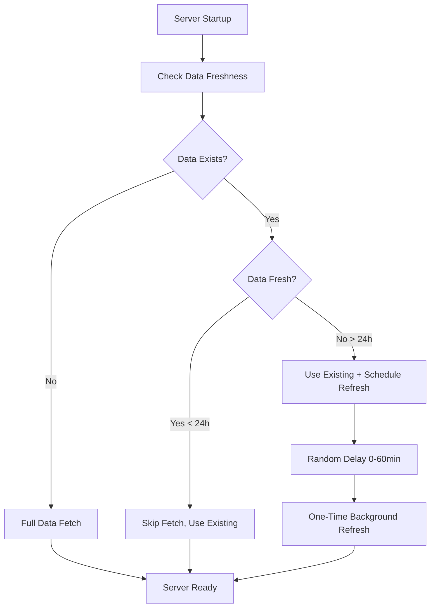

# Smart Data Fetching Implementation

## Overview

Implemented smart data fetching strategy to optimize server startup performance and reduce unnecessary data downloads. The system now intelligently decides when to fetch symbol data based on existing data freshness.

## Key Changes

### 1. Smart Startup Data Fetching

**Before**: Server always fetched fresh symbol data on every startup, causing slow startup times.

**After**: Server checks existing data and makes intelligent decisions:
- **No Data**: Proceeds with full data fetch (first-time setup)
- **Fresh Data** (< 24 hours): Skips fetch, uses existing data
- **Stale Data** (> 24 hours): Uses existing data but schedules one-time refresh

### 2. Data Freshness Detection

Added `checkDataFreshness()` method to `SymbolDatabaseService`:

```typescript
async checkDataFreshness(): Promise<{
  hasData: boolean;
  isFresh: boolean;
  totalSymbols: number;
  lastUpdated?: Date;
  ageHours?: number;
}>
```

**Logic**:
- Checks total symbol count in database
- Finds most recently updated symbol
- Calculates data age in hours
- Considers data "fresh" if updated within 24 hours

### 3. Scheduled One-Time Refresh

For stale data scenarios:
- Schedules a one-time refresh within the first hour (random delay 0-60 minutes)
- Prevents server startup delays while ensuring data gets updated
- Complements existing daily cron job scheduler

### 4. CORS Simplification

**Before**: Complex development/production CORS configuration with origin validation.

**After**: Simplified permissive CORS configuration:
- Allows all origins by default
- Removes complex branching logic
- Eliminates verbose debugging middleware
- Reduces potential CORS-related deployment issues

## Implementation Details

### Modified Files

1. **`backend/src/services/symbolDatabaseService.ts`**
   - Added `checkDataFreshness()` method
   - Fixed TypeScript optional property issues

2. **`backend/src/services/startupSymbolInitializationService.ts`**
   - Modified `initializeSymbolData()` to use smart fetching
   - Added `scheduleOneTimeRefresh()` method
   - Added `forceFullRefresh()` method for scheduled updates

3. **`backend/src/index.ts`**
   - Simplified CORS configuration
   - Removed development/production branching
   - Removed verbose CORS debugging middleware

### Smart Fetching Flow



## Benefits

### 1. Faster Server Startup
- **Fresh Data**: Instant startup (0 seconds data fetch time)
- **Stale Data**: Instant startup with background refresh
- **No Data**: Only scenario requiring startup delay

### 2. Reduced API Load
- Eliminates unnecessary data fetches on every restart
- Respects data source rate limits
- Reduces bandwidth usage

### 3. Better User Experience
- Server becomes available immediately
- No waiting for symbol data on restarts
- Background updates don't affect availability

### 4. Simplified Deployment
- Removed CORS complexity
- Fewer configuration variables needed
- Reduced potential for CORS-related issues

## Monitoring and Logging

Enhanced logging provides visibility into smart fetching decisions:

```
✅ Fresh symbol data already exists, skipping initialization
   - Total Symbols: 45,231
   - Last Updated: 2024-01-15T08:30:00Z
   - Age: 12.5 hours

🔄 Symbol data exists but is stale, scheduling one-time refresh
   - Total Symbols: 45,231
   - Last Updated: 2024-01-14T08:30:00Z
   - Age: 36.2 hours
   - Refresh scheduled in: 23 minutes
```

## Backward Compatibility

- Existing daily cron job continues to work unchanged
- Manual force refresh functionality preserved
- All existing API endpoints remain functional
- No breaking changes to external interfaces

## Configuration

No additional configuration required. The system uses sensible defaults:
- **Fresh Data Threshold**: 24 hours
- **Refresh Delay Range**: 0-60 minutes (random)
- **Minimum Symbol Count**: 1000 (configurable via `MIN_SYMBOL_COUNT` env var)

## Testing

Build process verified:
- ✅ TypeScript compilation: Clean
- ✅ Backend build: Successful
- ✅ Frontend build: Successful
- ✅ Full build pipeline: Working

## Next Steps

1. **Monitor Performance**: Track startup times and data freshness in production
2. **Tune Thresholds**: Adjust freshness threshold based on data update frequency
3. **Add Metrics**: Implement detailed metrics for smart fetching decisions
4. **Health Checks**: Add endpoints to monitor data freshness status

## Conclusion

The smart data fetching implementation significantly improves server startup performance while maintaining data freshness. The system now intelligently balances startup speed with data currency, providing a better experience for both development and production environments.